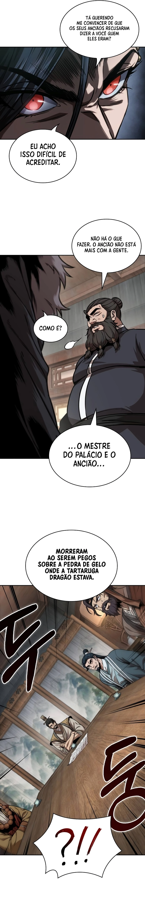
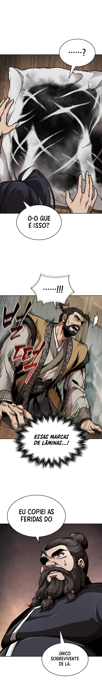
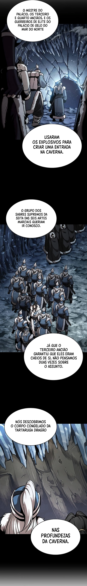

<button name="anterior" onclick="./chap-0241/readme.md">Anterior</button><button name="menu" onclick="./readme.md">Menu</button><button name="próximo" onclick="./chap-0243/readme.md">Próximo</button>
 
                             
 
<button name="anterior" onclick="./chap-0241/readme.md">Anterior</button><button name="menu" onclick="./readme.md">Menu</button><button name="próximo" onclick="./chap-0243/readme.md">Próximo</button>
