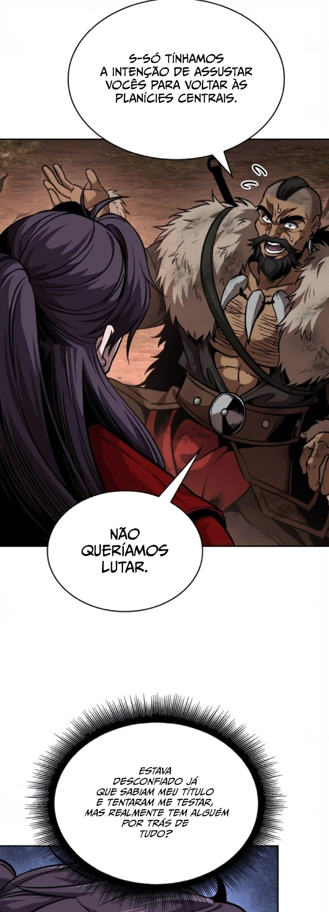
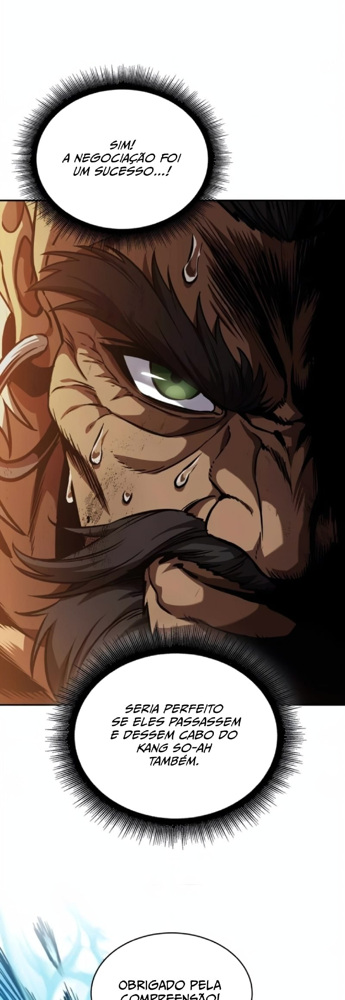
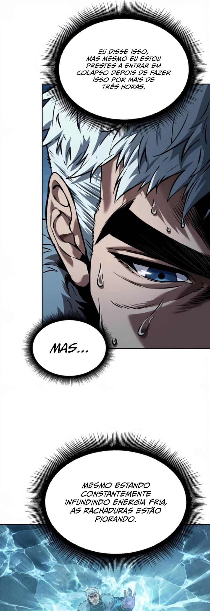

# chap-0248
##### [ANTERIOR](/chap-0247/readme.md)&nbsp;&nbsp;&nbsp;&nbsp;&nbsp;&nbsp;[MENU](/readme.md)&nbsp;&nbsp;&nbsp;&nbsp;&nbsp;&nbsp;[PRÓXIMO](/chap-0249/readme.md)

##### [ANTERIOR](/chap-0247/readme.md)&nbsp;&nbsp;&nbsp;&nbsp;&nbsp;&nbsp;[MENU](/readme.md)&nbsp;&nbsp;&nbsp;&nbsp;&nbsp;&nbsp;[PRÓXIMO](/chap-0249/readme.md)
